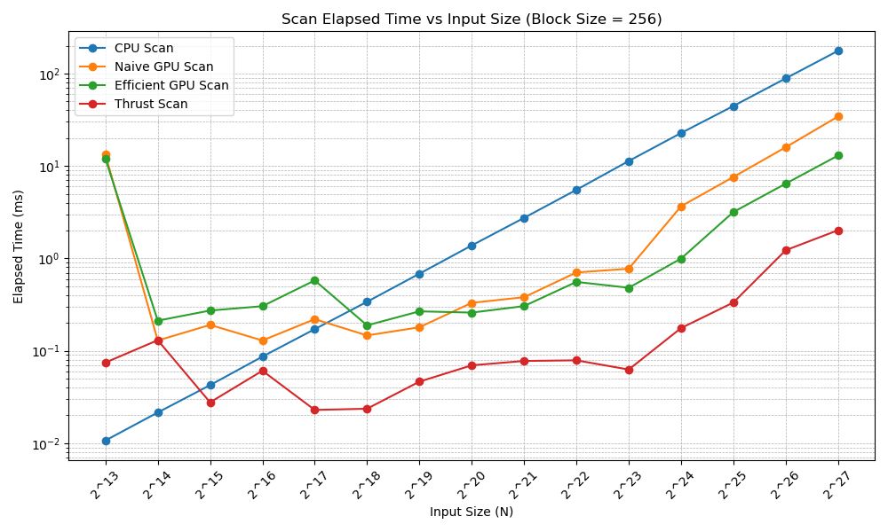
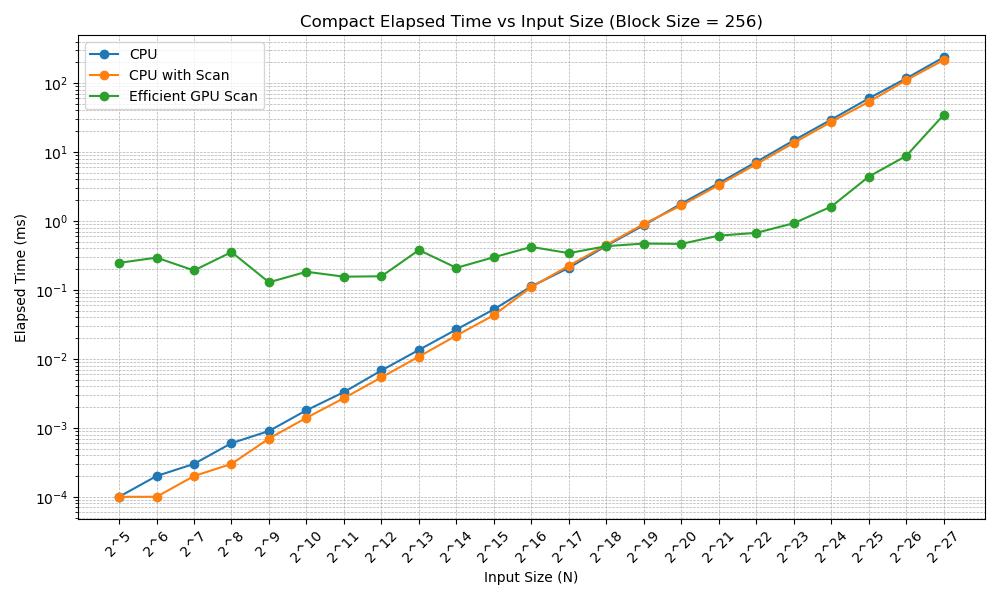
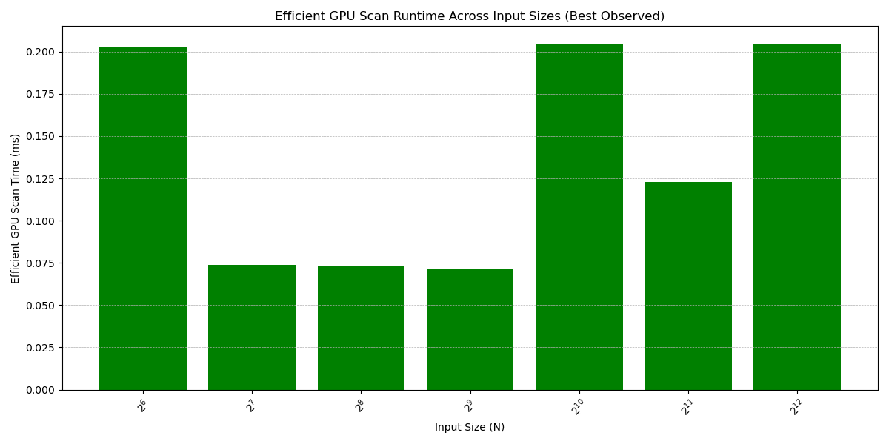

CUDA Stream Compaction
======================

**University of Pennsylvania, CIS 565: GPU Programming and Architecture, Project 2**  
**Author:** Yi Liu

## Tested On
- **OS:** Windows 11 Home Version 24H2 (OS Build 26100.4061)  
- **CPU:** Intel(R) Core(TM) i9-14900K @ 3.20GHz, 24 cores / 32 threads  
- **RAM:** 64 GB  
- **GPU:** NVIDIA GeForce RTX 4090, 24 GB VRAM  
- **Environment:** Visual Studio 2022, CUDA 12.6, CMake 3.27
---

## 🧩 Overview

This project focuses on implementing and optimizing **stream compaction** using CUDA. Stream compaction is a fundamental parallel algorithm that removes unwanted elements (e.g., zeros) from an array while preserving the order of the remaining elements.

To achieve this, multiple versions of **prefix sum (scan)** were implemented and benchmarked, as scan is a key building block in efficient stream compaction.

The primary goals of this project were:
- Implement different versions of stream compaction on the GPU.
- Compare them against a CPU baseline.
- Investigate performance characteristics and bottlenecks.

---

## ✅ Features Implemented

### 1. **CPU Stream Compaction (Baseline)**
- Simple sequential compaction for correctness verification and timing comparison.
- Iterates through input array, writing out only non-zero elements.

### 2. **GPU Stream Compaction with Scan**
- Performs compaction in three steps:
  1. **Map to Boolean**: Marks non-zero entries as 1 and zeros as 0.
  2. **Exclusive Scan**: Computes destination indices for the non-zero values.
  3. **Scatter**: Writes non-zero values to compacted output using scanned indices.

### 3. **Scan Implementations (for Compaction Support)**

#### • Naive GPU Scan
- Textbook parallel scan with \( O(n \log n) \) operations.
- New kernel launched at every depth level.

#### • Work-Efficient GPU Scan (Blelloch)
- Upsweep and downsweep phases for \( O(n) \) total work.
- Multiple kernel launches for each pass.

#### • Shared Memory Optimized Scan
- Uses block-level shared memory to reduce global memory traffic.
- Suitable for small arrays or single-block inputs.

#### • Thrust Library Scan
- Calls `thrust::exclusive_scan()` as a baseline for optimized GPU performance.

### 4. **GPU Radix Sort**
- Implements a multi-pass Least Significant Bit (LSB) radix sort for 32-bit integers.
- Each pass processes a single bit of all elements, classifying values based on 0 or 1 at that bit.
- Performs bit extraction, scan on inverted bits, and scatter to sort data based on the current bit.
- Uses the previously implemented work-efficient scan as a prefix sum primitive.
- Buffers are swapped each round to maintain sorted data across 32 passes.
- Suitable for sorting integer keys; stable and parallel-friendly.


---

## Test Cases Summary

This project includes a comprehensive suite of test cases across **scan**, **stream compaction**, and **radix sort**, covering both correctness and performance. Each test is designed to validate behavior on different input types, sizes (including power-of-two and non-power-of-two), and algorithm variants.

### Scan Tests
Tested scan variants include CPU, naive GPU, work-efficient GPU, Thrust, and shared memory scans.

| Test Description                               | Input Size         | Notes                                                |
|------------------------------------------------|--------------------|------------------------------------------------------|
| CPU scan                                       | 2¹⁹ = 524,288      | Baseline for correctness and performance             |
| Naive GPU scan (power-of-two / non-power-of-two) | 2¹⁹ and 393,931  | Launches multiple kernels per level                 |
| Work-efficient GPU scan (power-of-two / NPOT)  | 2¹⁹ and 393,931    | Implements upsweep/downsweep                        |
| Thrust GPU scan (power-of-two / NPOT)          | 2¹⁹ and 393,931    | Uses `thrust::exclusive_scan`                       |
| Shared memory naive scan                       | 512, 500, 32       | Small sizes for validating shared mem behavior      |
| Shared memory efficient scan                   | 512, 32            | Efficient scan in shared memory with loop unrolling |


### Stream Compaction Tests
Tested both CPU and GPU compaction with and without scan, for both power-of-two and non-power-of-two sizes.

| Test Description                               | Input Size         | Notes                                                |
|------------------------------------------------|--------------------|------------------------------------------------------|
| CPU compaction without scan (POT / NPOT)       | 524,288 / 393,931  | Sequential traversal                                 |
| CPU compaction with scan                       | 524,288            | Uses scan + scatter                                  |
| Work-efficient GPU compaction (POT / NPOT)     | 524,288 / 393,931  | Uses map-to-boolean + scan + scatter                |

### Radix Sort Tests
Includes correctness tests for various distributions and sizes, with special cases and large arrays.

| Test Case Description                          | Input Size         | Notes                                                |
|------------------------------------------------|--------------------|------------------------------------------------------|
| Random values                                  | 10                 | Basic unsorted small input                          |
| Already sorted                                 | 8                  | Best-case scenario                                  |
| Reverse sorted                                 | 8                  | Worst-case scenario                                 |
| Identical values                               | 6                  | Edge case: no change after sort                     |
| Contains duplicates                            | 9                  | Tests stable ordering                               |
| Large array (power-of-two)                     | 65,536             | Stress test for GPU sort                            |
| Large array (non-power-of-two)                 | 65,519             | Non-POT performance and correctness                 |
| Nearly sorted array with random swaps          | 16,384             | Realistic scenario with small local disorder        |

---

## Test Output Summary
Below are the results from running the full test suite, including scan, stream compaction, and radix sort performance and correctness checks.

<details>
<summary><strong>Click to expand full test log</strong></summary>

```plaintext
****************
** SCAN TESTS **
****************
    [  13  15  38  42  24   6  45   5  44  36  49  23  31 ...   8   0 ]
==== cpu scan, power-of-two ====
   elapsed time: 175.799ms    (std::chrono Measured)
    [   0  13  28  66 108 132 138 183 188 232 268 317 340 ... -1007801046 -1007801038 ]
==== cpu scan, non-power-of-two ====
   elapsed time: 176.075ms    (std::chrono Measured)
    [   0  13  28  66 108 132 138 183 188 232 268 317 340 ... -1007801093 -1007801087 ]
    passed
==== naive scan, power-of-two ====
   elapsed time: 34.0388ms    (CUDA Measured)
    passed
==== naive scan, non-power-of-two ====
   elapsed time: 33.9692ms    (CUDA Measured)
    passed
==== work-efficient scan, power-of-two ====
   elapsed time: 13.3369ms    (CUDA Measured)
    passed
==== work-efficient scan, non-power-of-two ====
   elapsed time: 12.9604ms    (CUDA Measured)
    passed
==== thrust scan, power-of-two ====
   elapsed time: 1.2496ms    (CUDA Measured)
    passed
==== thrust scan, non-power-of-two ====
   elapsed time: 1.21722ms    (CUDA Measured)
    passed
==== shared memory naive scan, power-of-two ====
   elapsed time: 0.005248ms    (CUDA Measured)
    passed
==== shared memory naive scan, non-power-of-two ====
   elapsed time: 0.00512ms    (CUDA Measured)
    passed
==== shared memory naive scan, small manual ====
   elapsed time: 0.004096ms    (CUDA Measured)
    [   0   0   1   3   6  10  10  11  13  16  20  20  21 ...  60  60 ]
    passed
==== shared memory efficient scan, power-of-two ====
   elapsed time: 0.00512ms    (CUDA Measured)
    passed
==== shared memory efficient scan, small manual ====
    passed

*****************************
** STREAM COMPACTION TESTS **
*****************************
    [   2   1   2   2   2   0   2   3   1   0   3   3   0 ...   0   0 ]
==== cpu compact without scan, power-of-two ====
   elapsed time: 239.519ms    (std::chrono Measured)
    [   2   1   2   2   2   2   3   1   3   3   1   3   1 ...   3   2 ]
    passed
==== cpu compact without scan, non-power-of-two ====
   elapsed time: 238.586ms    (std::chrono Measured)
    [   2   1   2   2   2   2   3   1   3   3   1   3   1 ...   2   3 ]
    passed
==== cpu compact with scan ====
   elapsed time: 217.626ms    (std::chrono Measured)
    [   2   1   2   2   2   2   3   1   3   3   1   3   1 ...   3   2 ]
    passed
==== work-efficient compact, power-of-two ====
   elapsed time: 33.9799ms    (CUDA Measured)
    [   2   1   2   2   2   2   3   1   3   3   1   3   1 ...   3   2 ]
    passed
==== work-efficient compact, non-power-of-two ====
   elapsed time: 33.5489ms    (CUDA Measured)
    [   2   1   2   2   2   2   3   1   3   3   1   3   1 ...   2   3 ]
    passed

***********************
** RADIX SORT TESTS  **
***********************
==== radix sort - random ints ====
    [   0   1   2   3   4   5   6   7   8   9 ]
    passed
==== radix sort - already sorted ====
    [   0   1   2   3   4   5   6   7 ]
    passed
==== radix sort - reverse sorted ====
    [   0   1   2   3   4   5   6   7 ]
    passed
==== radix sort - identical elements ====
    [  42  42  42  42  42  42 ]
    passed
==== radix sort - contains duplicates ====
    [   0   1   1   2   3   3   5   7   9 ]
    passed
==== radix sort - large array (pow2) ====
   elapsed time: 0.174848ms    (CUDA Measured)
    passed
==== radix sort - large array (non-pow2) ====
   elapsed time: 0.200704ms    (CUDA Measured)
    passed
==== radix sort - nearly sorted with random swaps ====
   elapsed time: 0.233664ms    (CUDA Measured)
    passed
```
</details> 

---

## Scan Runtime Analysis

The figure below shows the elapsed time (in milliseconds) of four scan implementations measured across input sizes ranging from \(2^{13}\) to \(2^{27}\), using a fixed block size of 256. All tests were run in **Release mode** to ensure optimized performance, particularly for the Thrust-based implementation.



### Key Observations

#### Performance at Small Sizes (\(2^{13} → 2^{17}\))
- **Thrust Scan** performs exceptionally well, benefiting from Release-mode optimizations that eliminate overhead seen in debug builds.
- **Naive GPU Scan** outperforms the Efficient GPU Scan in this range. This may be due to:
  - Fewer kernel launches (one per depth level with simpler memory patterns)
  - Lower overhead from global memory usage per pass
- **CPU Scan** starts very fast but scales poorly beyond this point.

#### Mid-Range Sizes (\(2^{18} → 2^{20}\))
- **Thrust Scan** continues to lead, maintaining low latency while other methods begin to scale more steeply.
- **Naive GPU Scan** begins to show inefficiencies due to redundant memory access and higher algorithmic complexity.

#### Large Sizes (\(2^{21} → 2^{27}\))
- **Thrust Scan** remains the fastest and scales efficiently, highlighting its well-optimized internal operations.
- **Naive GPU Scan** slows down due to its \(O(n \log n)\) complexity and less efficient memory use.
- **CPU Scan** becomes the slowest by far, with consistent linear growth.

Overall, Thrust offers the best performance across all input sizes when compiled in Release mode, while the Efficient GPU Scan provides a solid custom alternative with strong performance at small to mid-range sizes. The CPU scan, although fast for small inputs, follows a linear \(O(n)\) time complexity and becomes the slowest as input sizes grow.

---

## Compact Runtime Analysis

The plot below shows the runtime performance (in milliseconds) of three different stream compaction implementations as a function of input size \(N\), ranging from \(2^5\) to \(2^{27}\). All tests were conducted using a fixed CUDA block size of 256 and compiled in **Release mode** to ensure optimal performance.



### Key Observations

#### CPU vs CPU with Scan
- For small input sizes (\(N ≤ 2^{16}\)), both CPU variants show very similar runtimes, indicating that the scan step contributes little overhead in this range.
- Both exhibit consistent linear growth on the log-log plot, confirming the expected **\(O(n)\)** time complexity for serial execution.

#### Efficient GPU Scan
- The GPU implementation shows near-constant runtime across small and mid-sized inputs (up to \(2^{21}\)), demonstrating its scalability due to parallel execution and efficient memory usage.
- Beyond \(2^{21}\), the runtime begins to increase gradually. This likely reflects:
  - The need to process more data in global memory
  - Increased number of kernel launches
- Even at \(N = 2^{27}\), GPU runtime remains well under 50 ms — significantly outperforming the CPU implementations, which exceed 100 ms at that scale.

---

## Efficient GPU Scan Runtime Analysis (Global Memory Implementation)

The bar chart below displays the runtime (in milliseconds) of a work-efficient Blelloch-style GPU scan implementation that operates entirely in global memory. No shared memory or warp-level primitives are used. 



### Key Observations

- For mid-sized inputs (\(2^7\) to \(2^9\)), the scan shows consistently low runtimes (~0.07 ms), indicating effective thread-level parallelism despite global memory latency.
- Noticeable spikes occur at sizes \(2^6\), \(2^{10}\), and \(2^{12}\), where runtime increases by 2–3× compared to neighboring sizes. These performance dips likely stem from:
  - **Uncoalesced memory access** due to thread divergence at these specific sizes
  - **Extra overhead** from partial warp utilization or thread underpopulation in early/late stages of the scan
  - **Depth-related kernel launches**: For \(N = 2^{13}\), the number of upsweep and downsweep steps increases, amplifying launch and global memory access costs
- The runtime drop at \(2^{11}\) suggests that thread/block configuration for that size aligns better with the kernel design, temporarily improving efficiency.

### Best Performance

The most optimal performance is observed between \(2^7\) and \(2^9\), where the runtime stabilizes around **0.07 ms**. This range can be considered the **sweet spot** for this global memory-based scan implementation, offering the lowest latency and most consistent performance across all tested input sizes. 

---

## Part 5: Why Is My Efficient GPU Scan Sometimes Slower Than CPU and Even Slower Than Naive?

The efficient GPU scan, although theoretically better in terms of work complexity \(O(n)\), is sometimes slower than both the CPU scan and the naive GPU scan. After analyzing my implementation and reviewing how GPUs work, here is my explanation:

### kernel launch overhead becomes significant
In my implementation, for each depth level of both upsweep and downsweep, I launch a separate kernel. Since the depth is \(\log_2(n)\), I am launching multiple kernels even for small input sizes.
On GPUs, kernel launches have some non-negligible overhead, especially when the amount of computation per launch is small. When input size is small, the kernel launch overhead actually dominates the total runtime.
In contrast, CPU scan uses a simple loop without any such overhead.

### thread utilization becomes poor at deeper levels
At each level \(d\), the number of active threads launched is reduced:
- At the first level, many threads are working.
- As \(d\) increases, fewer and fewer threads are needed.
- For very deep levels, I might be launching blocks where only a few threads are doing useful work while many others are idle.

This results in low occupancy and poor utilization of GPU resources. Even though many threads exist, most of them are effectively "lazy" and just sitting idle at deeper levels.

### global memory access pattern is inefficient
In each kernel, threads read and write data directly to global memory:
- The access pattern involves strided addresses like `data[k + (1 << d) - 1]` and `data[k + (1 << (d + 1)) - 1]`.
- As \(d\) increases, these strides get larger, and global memory accesses become more scattered and less coalesced.
- Uncoalesced memory access wastes memory bandwidth and increases latency.

On the CPU, memory access is sequential and benefits from caching, which makes its memory much more efficient.

## Summary Table

| Factor | CPU Scan | Naive GPU Scan | Efficient GPU Scan |
|--------|----------|----------------|---------------------|
| Complexity | \(O(n)\) | \(O(n \log n)\) | \(O(n)\) |
| Memory Pattern | Sequential | Coalesced | Strided (degrades at deeper levels) |
| Kernel Launches | 1 | \(\log n\) | \(2 \log n\) |
| Warp Utilization | N/A | High | Drops significantly at deeper levels |
| Global Memory Traffic | Low | Moderate | High |

---

## Extra Credit Summary

For the extra credit, I implemented several additional features and optimizations beyond the baseline requirements:

1. **Shared Memory Optimized Naive Scan (`sharednaivemem.cu/h`)**  
   - Added shared memory support to the naive scan to reduce global memory traffic and improve performance on small input sizes.

2. **Shared Memory Optimized Work-Efficient Scan (`sharedefficientmem.cu/h`)**  
   - Applied shared memory to the work-efficient scan, optimizing intra-block upsweep and downsweep phases to minimize global memory accesses.

3. **Radix Sort Implementation (`radix.cu/h`)**  
   - Implemented Least Significant Bit (LSB) Radix Sort using scan as a building block to perform bitwise sorting across 32 passes.

4. **Extra Credit Question: Why Efficient Scan Can Be Slower**  
   - Provided a explanation on why the efficient scan may perform worse than naive scan or CPU scan for certain input sizes, due to factors such as kernel launch overhead, low thread occupancy at deeper levels, and non-coalesced memory accesses.
